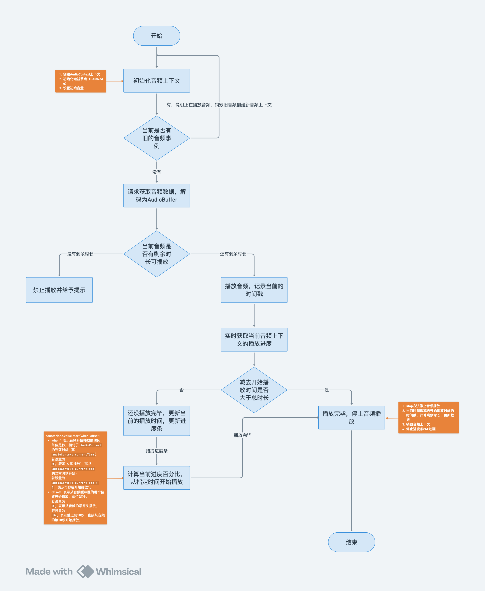

# 刀刀音乐

## 在线体验

[刀刀音乐](https://duyidao.github.io/music-web/)

## 版本

- Node：20.15.0
- pnpm：8.11.0
- Vite：4。5.0

## 项目运行

1. git clone 拉取项目
2. pnpm i 安装依赖
3. pnpm dev 运行项目
4. pnpm build 打包项目

## 项目结构

```
├── README.md
├── index.html
├── package.json
├── src
│   ├── App.vue
│   ├── assets
│   │   ├── music
│   │   ├── images
│   ├── components
│   ├── main.js
│   ├── store
│   ├── utils
└── vite.config.js
```

## 基础功能

### 项目功能

- 播放音频
  
  点击播放按钮、上一首下一首按钮、列表可播放音频

- 时长购买
  
  输入要购买的时长，点击购买按钮，可以购买对应的播放时长（单位：秒）

- 歌曲切换
  
  点击上一首/下一首按钮，或者点击歌曲列表，切换歌曲

### 思维导图



### BUG与弊端

1. 每次想要听某首歌，都需要点击后才调接口，听完后听下一首歌，再次返回听上一首歌时，还需要重新请求接口，浪费资源

  解决思路：用任务队列，项目初始化后，把所有歌曲通过任务队列依次请求资源，一次请求4条。请求完毕后把数据保存到 `Map` 中，后续可以从 `Map` 中获取数据，无需再次请求。

2. 快速点击上一首/下一首按钮，会出现上一个音频没卸载完的情况，导致重叠播放音频
   
  解决思路：为播放事件添加防抖，然后封装竟态取消函数，取消上一次的播放，再进行播放。